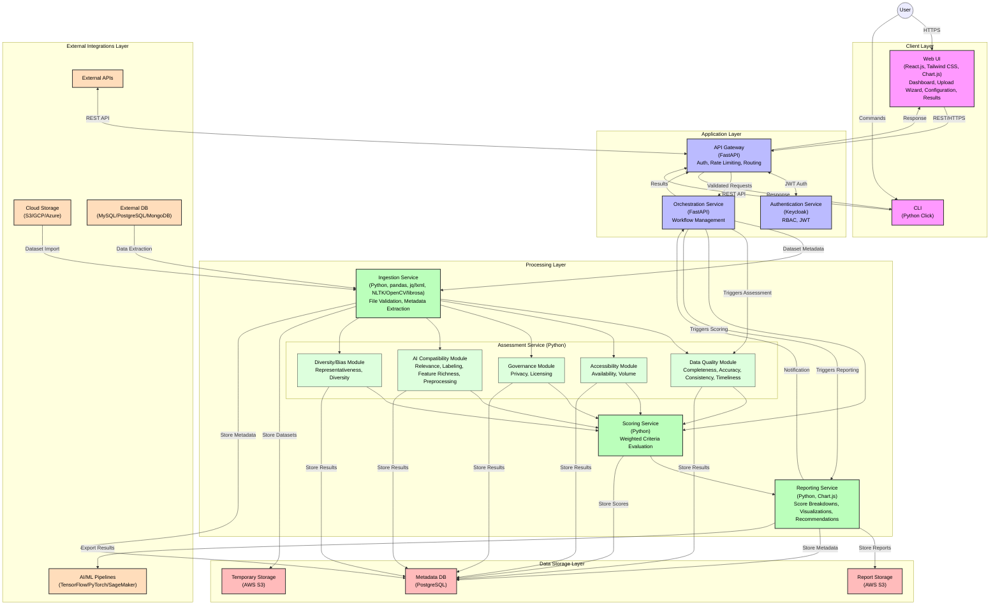

# DataAptor AI - Detailed Architecture Diagram

## Viewing the Diagram

To view this Mermaid diagram:
1. Use a Markdown editor that supports Mermaid syntax (like VS Code with Mermaid extension)
2. Or paste the Mermaid code into an online Mermaid editor like [Mermaid Live Editor](https://mermaid.live/)
3. In GitHub, this diagram will render automatically if the repository has Mermaid rendering enabled
