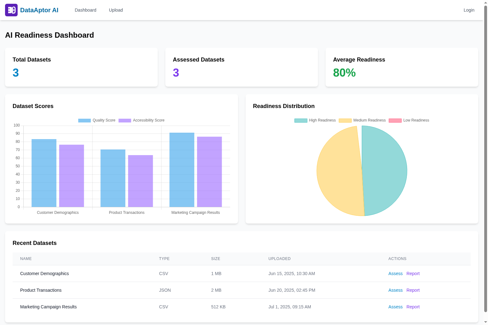
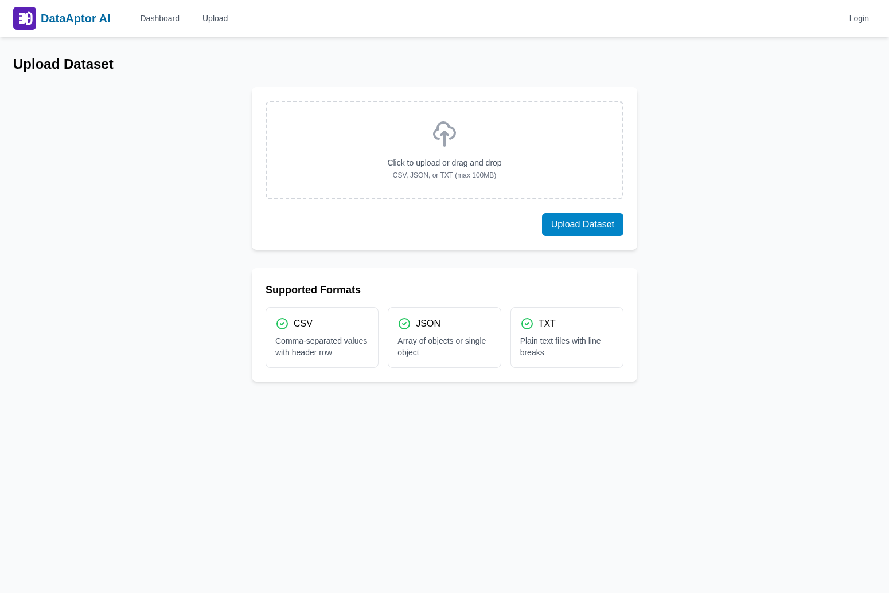
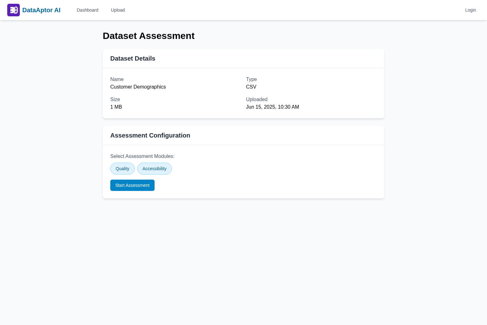
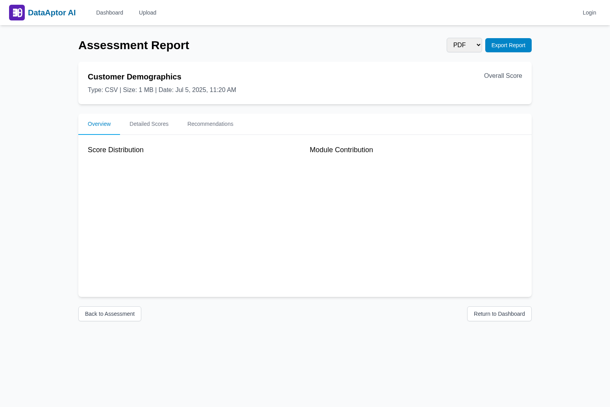

# DataAptor AI

A comprehensive platform for assessing the AI readiness of datasets, providing scoring, and actionable recommendations.

## Overview

DataAptor AI helps data scientists, engineers, and organizations evaluate the readiness of their datasets for AI/ML applications by analyzing key criteria such as data quality, accessibility, governance, AI compatibility, and diversity.

## Features

- Automated assessment of structured, semi-structured, and unstructured datasets
- Standardized scoring methodology across multiple readiness dimensions
- Detailed reports with visualizations and actionable recommendations
- Integration with popular data storage platforms and AI/ML pipelines
- Support for various dataset types (CSV, JSON, XML, text, images, audio)

## Screenshots

### Dashboard
The main dashboard provides an overview of all datasets, their assessment scores, and readiness distribution.

### Upload Dataset
Upload datasets in various formats (CSV, JSON, TXT) with drag-and-drop support.

### Assessment Configuration
Configure assessment modules and trigger evaluations on your datasets.

### Assessment Report
View detailed assessment reports with score breakdowns, visualizations, and export options.

## Project Structure

This repository is organized using a microservices architecture with the following key components:

- **Client Layer**: Web UI and CLI interfaces
- **Application Layer**: API Gateway, Authentication, and Orchestration
- **Processing Layer**: Ingestion, Assessment, Scoring, and Reporting services
- **Data Storage Layer**: Metadata DB and storage connectors
- **External Integrations Layer**: Cloud storage, database, and AI pipeline integrations

## Getting Started

Please see the [Development Guide](docs/development/README.md) for setup instructions.

## Documentation

- [Architecture Documentation](docs/architecture/ArchitectureDocument.md)
- [API Documentation](docs/api/README.md)
- [User Guides](docs/user-guides/README.md)
- [Development Guides](docs/development/README.md)

## Contributing

We welcome contributions to the DataAptor AI project! Please see our [Contributing Guide](CONTRIBUTING.md) for details on how to get started, coding standards, and our development process.

## License

[MIT License](LICENSE)
